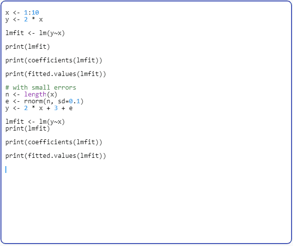

# Syntax Highlighter

이 소스코드는 Flutter 프레임워크에서 특정 프로그래밍 언어의 코드 String으로부터 syntax highlighting이 적용된 TextSpan을 반환하는 SyntaxHighlighter 클래스를 구현한 코드입니다.

- SyntaxHighlighter클래스에는 기본적으로 highlight 메소드가 있으며, 키워드와 숫자, 따옴표로 묶인 문자열, 주석을 인식합니다. 이 클래스를 확장하여 언어마다 다양한 highlight를 적용할 수 있습니다.

- SyntaxHighlighterGenerator를 반환하는 getHighlighterWithName함수로부터 string만으로 특정 syntax highlighter를 받아올 수 있습니다.

예시로 통계 언어 R에 대한 RSyntaxHighlighter를 추가했으니 참고 바랍니다. RSyntaxHighlighter의 경우 keyword, literals, built-in, number, quoted string, comment를 인식합니다.

SyntaxHighlighter의 highlight 및 기타 메소드들은 완전하지 않을 수 있습니다. 이슈가 제보되거나 발견되면 제가 고치려고 노력하겠으나, 빠른 피드백은 어렵습니다. 대신 소스코드가 간단하므로 직접 커스터마이징하시길 추천드립니다.

---

This source code is the implementation of the SyntaxHighlighter class that returns a TextSpan with syntax highlighting applied from the code String of a specific programming language in the Flutter framework.

- SyntaxHighlighter class basically has a 'highlight' method and recognizes keywords, numbers, quoted strings, and comments. You can extend this class to apply different highlights for different languages.

- You can get a specific syntax highlighter with only string from getHighlighterWithName function that returns SyntaxHighlighterGenerator.

As an example, I have added RSyntaxHighlighter for the statistical language R. RSyntaxHighlighter recognizes keywords, literals, built-in, number, quoted string, and comment.

SyntaxHighlighter's highlights and other methods may not be complete. If an issue is reported or found, I will try to fix it, but it will be difficult for me to give quick feedback. Instead, the source code is simple, so I recommend customizing it yourself.